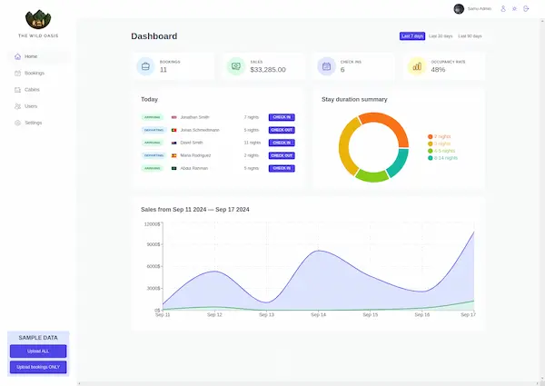

 
<h2> 
<em>Wild Oasis</em> - Aplicación interactiva creada con React 
</h2> 

 
Proyecto desarrollado como parte de un curso de React. Explora la creación de componentes dinámicos y gestión de estado en una aplicación moderna de cabañas.

 

 Creado siguiendo los cursos de <a href="https://codingheroes.io/">Jonas Schmedtmann</a>

    <a href="#empezar">
        Empezar
    </a>
    &nbsp;✦&nbsp;
    <a href="#comandos">
        Comandos
    </a>
    &nbsp;✦&nbsp;
    <a href="#usuario">
        Usuario
    </a>

  

 
  

</img>

## Stack

- [**React**](https://es.react.dev/) - Librería de JavaScript para construir interfaces de usuario.
- [**Styled-Components**](https://styled-components.com/) - Modularización de estilos para componentes.
- [**Supabase**](https://supabase.com/) - Supabase es una alternativa de código abierto a Firebase.
  Inicie su proyecto con una base de datos de Postgres, autenticación, API instantáneas, funciones perimetrales, suscripciones en tiempo real, almacenamiento e incrustaciones de vectores.
- [**Vite**](https://vitejs.dev/) - Herramienta rápida para construir aplicaciones modernas con soporte para React.

## Usuario

> Utiliza este usuario para probar :
>
> <em>email</em> : testuser@test.com 
 > <em>password</em> : test1234

